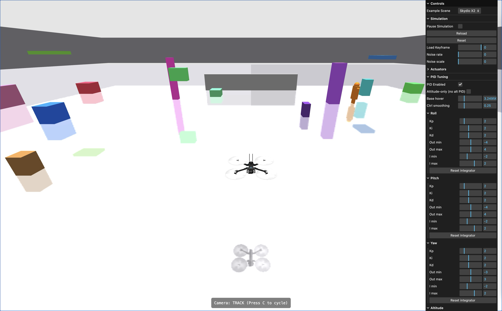

# MuJoCo WebAssembly Simulation

<p align="center">
  <a href="https://mujoco-wasm.vercel.app/"></a>
</p>

## 🚁 Interactive Physics Simulation in Your Browser

Experience the power of MuJoCo physics simulation directly in your web browser. This project provides real-time interactive simulation with drone control, robot dynamics, and advanced physics modeling using WebAssembly technology.

### [🎮 Try the Live Demo](https://mujoco-wasm.vercel.app/)

---

## ✨ Features

- **Real-time Physics**: Advanced MuJoCo physics simulation running at 60 FPS in browser
- **Interactive Control**: Keyboard and mouse controls for dynamic simulation interaction
- **Multiple Scenarios**: Skydio X2 drone, Boston Dynamics Spot robot, and various physics demos
- **Camera System**: Multiple viewing modes including orbit, track, and fixed perspectives
- **PID Control**: Advanced control algorithms for realistic drone flight dynamics
- **Cross-Platform**: Runs on any modern web browser with WebAssembly support

---

## 🎯 Quick Start

### Running the Simulation

1. **Clone the repository:**

   ```bash
   git clone https://github.com/zalo/mujoco_wasm.git
   cd mujoco_wasm
   ```

2. **Serve the files locally:**

   ```bash
   # Using Python
   python -m http.server 8000

   # Or using Node.js
   npx serve .
   ```

3. **Open in browser:**
   Navigate to `http://localhost:8000` and enjoy the simulation!

---

## 🎮 Controls

### Drone Control (Skydio X2)

The simulation supports two control modes:

#### Manual Mode

- **W/S**: Pitch forward/backward
- **A/D**: Roll left/right
- **Space**: Ascend (increase thrust)
- **Z**: Descend (decrease thrust)

#### PID Control Mode (Default)

Advanced automated flight control with stability assistance:

- **W/S**: Set pitch target (-15° to +15°)
- **A/D**: Set roll target (-15° to +15°)
- **Space**: Increase altitude target
- **Z**: Decrease altitude target

### Camera Controls

- **C**: Cycle camera modes (Orbit → Track → Fixed)
- **Mouse**: Orbit camera control (in Orbit mode)
- **Mouse Wheel**: Zoom in/out

### GUI Controls

- **Right Panel**: Real-time parameter adjustment
- **Pause/Play**: Simulation control
- **Reset**: Restore initial state
- **Speed**: Adjust simulation speed

---

## 🔧 PID Control System

### Overview

The drone uses a sophisticated PID (Proportional-Integral-Derivative) control system for stable flight:

```javascript
class PID {
  constructor(kp = 0, ki = 0, kd = 0, outMin = -Infinity, outMax = Infinity)
}
```

### Control Axes

- **Roll PID**: Controls left/right tilt (A/D keys)
- **Pitch PID**: Controls forward/backward tilt (W/S keys)
- **Yaw PID**: Controls rotation (automatically stabilized)
- **Altitude PID**: Controls vertical position (Space/Z keys)

### Default Parameters

```javascript
// All PIDs use default gains:
kp = 2.0; // Proportional gain
ki = 2.0; // Integral gain
kd = 2.0; // Derivative gain
```

### Features

- **Anti-windup**: Prevents integral term from growing excessively
- **Output Limits**: Constrains control signals to safe ranges
- **Gaussian Noise**: Adds realistic control jitter
- **Automatic Stabilization**: Returns to level flight when inputs released

---

## 🛠 Build Instructions

### Prerequisites

- **Emscripten SDK**: For WebAssembly compilation
- **CMake**: Build system
- **Python 3**: For binding generation

### Building from Source

1. **Install Emscripten:**

   ```bash
   git clone https://github.com/emscripten-core/emsdk.git
   cd emsdk
   ./emsdk install latest
   ./emsdk activate latest
   source ./emsdk_env.sh
   ```

2. **Generate bindings:**

   ```bash
   python src/parse_mjxmacro.py
   ```

3. **Build WebAssembly:**

   ```bash
   mkdir build
   cd build
   emcmake cmake ..
   make
   ```

   **Windows users:** Run `build_windows.bat` instead.

### JavaScript API

```javascript
import load_mujoco from "./mujoco_wasm.js";

// Load the MuJoCo Module
const mujoco = await load_mujoco();

// Set up Virtual File System
mujoco.FS.mkdir("/working");
mujoco.FS.mount(mujoco.MEMFS, { root: "." }, "/working");

// Load simulation
let model = new mujoco.Model("/working/scene.xml");
let state = new mujoco.State(model);
let simulation = new mujoco.Simulation(model, state);
```

TypeScript definitions are included for full IDE support.

---

## 📁 Available Scenes

- **skydio_x2**: Advanced quadrotor drone with PID control
- **boston_dynamics_spot**: Quadruped robot simulation
- **humanoid**: Bipedal robot with 22 degrees of freedom
- **combined_drone_spot**: Multi-agent simulation
- **22_humanoids**: Large-scale crowd simulation
- **de_dust2**: CS:GO map environment for testing
- **And many more...** (see `/examples/scenes/`)

---

## 📜 License & Attribution

### This Project

This project is licensed under the **MIT License**. See [LICENSE](LICENSE) file for details.

### Third-Party Components

#### MuJoCo Physics Engine

- **License**: Apache License 2.0
- **Copyright**: Google DeepMind (formerly Roboti LLC)
- **Attribution**: This project uses MuJoCo physics simulation
- **Repository**: https://github.com/google-deepmind/mujoco

#### Three.js 3D Library

- **License**: MIT License
- **Copyright**: © 2010-2025 three.js authors
- **Attribution**: 3D rendering powered by Three.js
- **Repository**: https://github.com/mrdoob/three.js

#### lil-gui Control Panel

- **License**: MIT License
- **Author**: George Michael Brower
- **Repository**: https://github.com/georgealways/lil-gui

#### OrbitControls

- **License**: MIT License (part of Three.js examples)
- **Usage**: Camera control system

### Compliance Notes

- All required copyright notices are preserved
- Attribution requirements are met per each license
- Compatible with both personal and commercial use
- No additional restrictions imposed

---

## 🤝 Contributing

We welcome contributions! Here's how you can help:

### Development Setup

1. Fork the repository
2. Create a feature branch: `git checkout -b feature-name`
3. Make your changes and test thoroughly
4. Submit a pull request with a clear description

### Areas for Contribution

- New simulation scenarios
- Control system improvements
- Performance optimizations
- Documentation enhancements
- Bug fixes and testing

### Code Style

- Follow existing JavaScript/C++ conventions
- Comment complex physics calculations
- Test on multiple browsers
- Maintain TypeScript definitions

---

## 🐛 Troubleshooting

### Common Issues

**Simulation won't load:**

- Ensure WebAssembly is supported in your browser
- Check browser console for error messages
- Try serving files over HTTP (not file://)

**Poor performance:**

- Close other browser tabs
- Reduce simulation speed in GUI
- Try a different scene with fewer objects

**Controls not working:**

- Click in the simulation area to focus
- Check if PID mode is enabled/disabled as intended
- Verify keyboard layout (WASD keys)

**Build failures:**

- Ensure Emscripten version compatibility (<3.1.56 recommended)
- Check that all dependencies are installed
- Verify Python path in build scripts

### Getting Help

- Check existing [GitHub Issues](https://github.com/zalo/mujoco_wasm/issues)
- Create a new issue with detailed description
- Include browser/OS information for bugs

---

## 🔬 Technical Details

### Architecture

- **Frontend**: Vanilla JavaScript with ES6 modules
- **Physics**: MuJoCo 2.3.1 compiled to WebAssembly
- **Graphics**: Three.js WebGL renderer
- **Controls**: Custom input management system
- **Build**: CMake + Emscripten toolchain

### Performance

- **Target**: 60 FPS real-time simulation
- **Physics Step**: Variable timestep with interpolation
- **Rendering**: Optimized mesh updates and culling
- **Memory**: Efficient WASM heap management

### Browser Support

- Chrome/Chromium 85+ (recommended)
- Firefox 85+
- Safari 14+
- Edge 85+
- Mobile browsers (limited performance)

---

## 🙏 Acknowledgments

Special thanks to:

- **@stillonearth** for the original starter repository
- **Google DeepMind** for open-sourcing MuJoCo
- **Three.js team** for the excellent 3D library
- **Emscripten team** for WebAssembly compilation tools
- The open-source physics simulation community

---

## 📞 Contact & Links

- **Original Repository**: https://github.com/zalo/mujoco_wasm
- **Live Demo**: https://mujoco-wasm.vercel.app/
- **MuJoCo Official**: https://mujoco.org/
- **Three.js Official**: https://threejs.org/

---

_Built with ❤️ for the robotics and simulation community_
